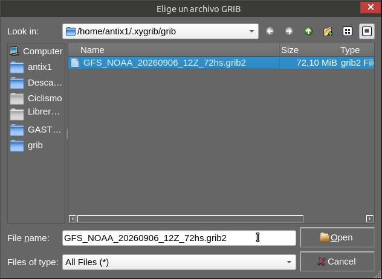
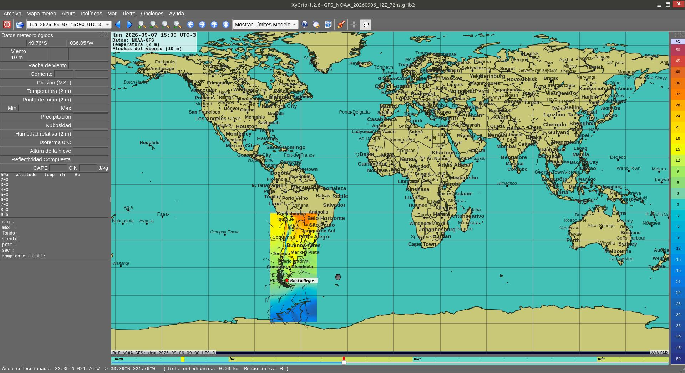
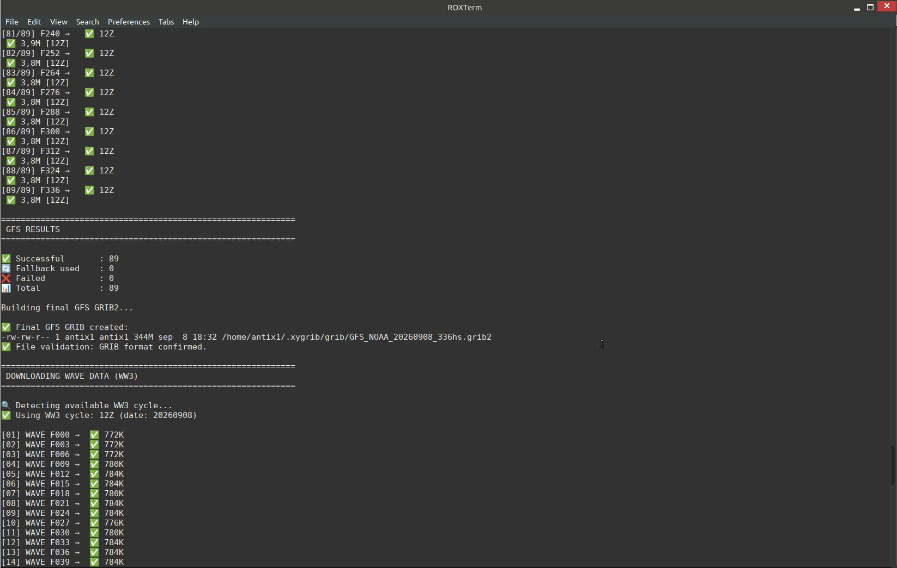
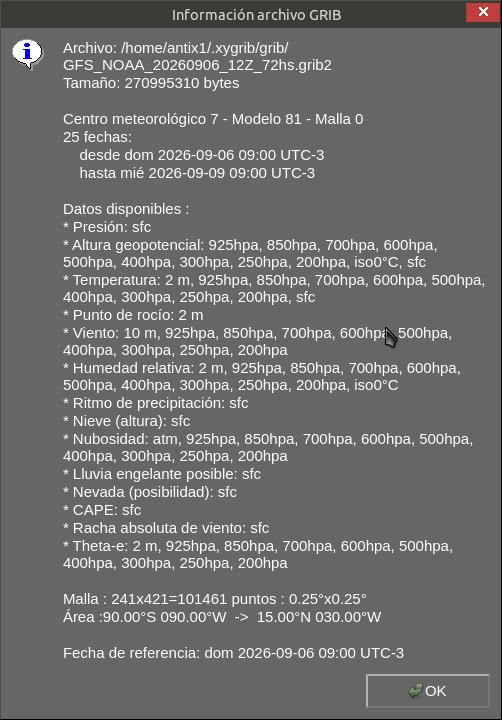
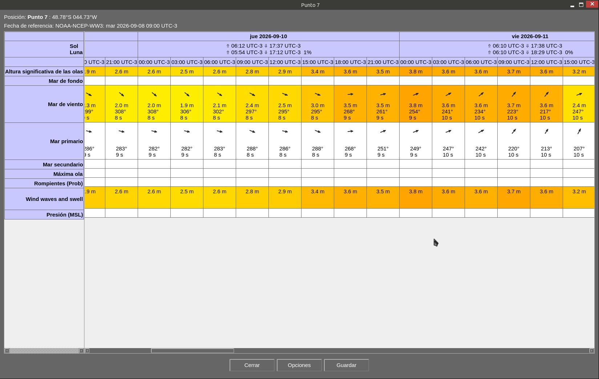
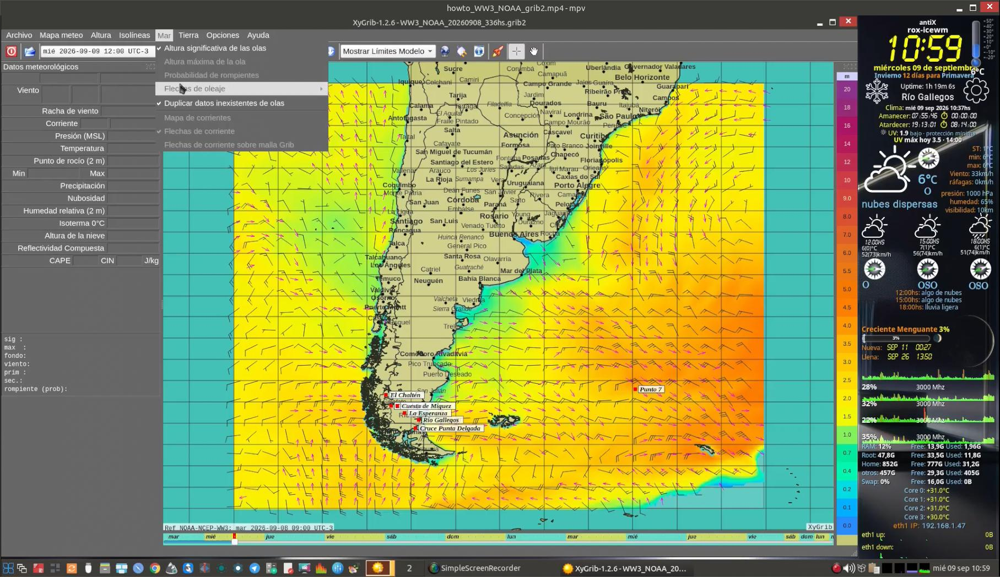
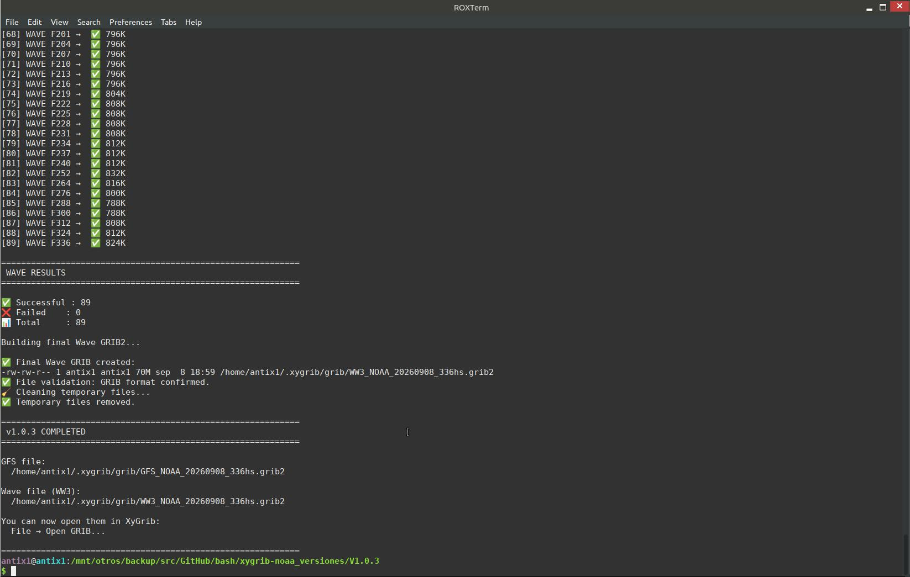
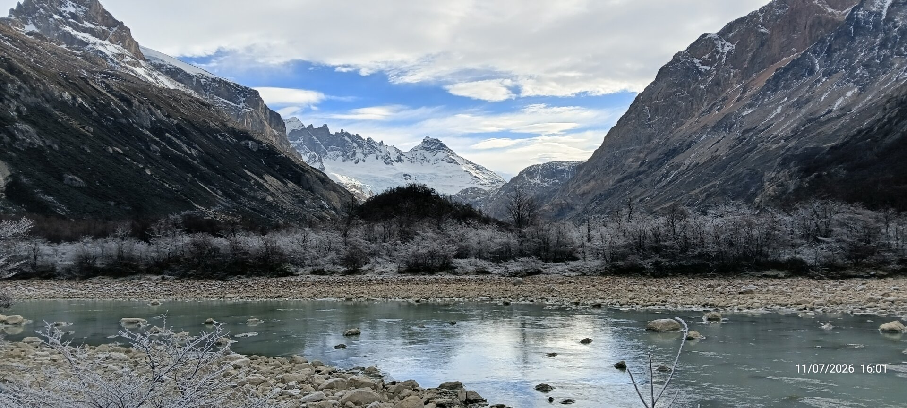

# GFS NOAA NOMADS Downloader for XyGrib — GRIB2 Forecast

[](LICENSE)
[](https://www.gnu.org/software/bash/)

> **Direct download from NOAA/NOMADS of a GRIB2 forecast, ready for XyGrib.**  
> Eliminates dependency on the OpenGribs intermediary server.  
> **Now with optional wave data (WW3), a combined GFS+WW3 file, and atomic single-cycle downloads.** 🌊

---

## 📌 Background

Since **September 2026**, the OpenGribs server that generates and serves GRIB datasets for XyGrib has been down ([issue #326](https://github.com/opengribs/XyGrib/issues/326)).

This script **downloads directly from the official source (NOAA NOMADS)** and builds a **GRIB2** that XyGrib can open without intermediaries.

✅ **No OpenGribs dependency**  
✅ **No GUI required**  
✅ **Only `curl` and Bash**  
✅ **Configurable forecast horizon (0-384 hours)**  
✅ **Includes 0°C isotherm** (validated in Río Gallegos)  
✅ **Optional wave data (WW3)** — height, direction, period  
✅ **Robust and reliable** — automatic cycle detection, fallback, and retry

---

## 🚀 Features

| Feature | Detail |
|---|---|
| **Model** | GFS 0.25° (NOAA/NCEP) |
| **Cycle** | **Automatic detection** (18Z → 12Z → 06Z → 00Z) with full-horizon validation |
| **Horizon** | 0 – 384 hours (configurable, default 72h / 3 days) |
| **Interval** | 3 hours (0-240h) / 12 hours (240-384h) |
| **Region** | `-90°W` to `-50°W` / `-60°S` to `-38°N`<br>(South America and surrounding waters) *configurable* |
| **Variables** | Temperature, wind, gusts, pressure, humidity, cloud cover, precipitation, snow, CAPE, **0°C isotherm**, freezing rain, etc. |
| **Output** | Single GRIB2 in `~/.xygrib/grib/GFS_NOAA_YYYYMMDD_CYCLEz_XXhs.grib2` |
| **Temporaries** | Stored in `/tmp/gfs-...` and **automatically cleaned up** after execution |
| **Validation** | Automatic GRIB format check using `file` command |
| **Error handling** | 3 retries per file against the same cycle; abort if too many fail |
| **Fallback date** | Automatic retry with previous days if no cycles available |
| **Progress** | Compact output with per-file status (`[01/25] F000 → ✅ 12Z`) |
| **🌊 Wave data (WW3)** | **Optional** — height, direction, period, with intelligent file detection |
| **🌊 Combined file** | **New in v1.0.4** — GFS + WW3 concatenated into one GRIB2, so wind and waves appear in the same XyGrib session |
| **🔒 Cycle integrity** | **New in v1.0.5** — downloads are bound to one cycle; GFS+WW3 combined only if both match |

---

## 📦 Installation

### Option 1 — Clone the repository

```bash
cd ~/bin  # or any directory in your PATH
git clone https://github.com/DrCalambre/GFS_NOAA_NOMADS_Downloader_for_XyGrib-72h_GRIB2_Forecast
cd GFS_NOAA_NOMADS_Downloader_for_XyGrib-72h_GRIB2_Forecast
chmod +x xygrib-noaa.sh
```

### Option 2 — Direct download

```bash
wget https://raw.githubusercontent.com/DrCalambre/GFS_NOAA_NOMADS_Downloader_for_XyGrib-72h_GRIB2_Forecast/main/xygrib-noaa.sh
chmod +x xygrib-noaa.sh
```

### Option 3 — Manual copy

If you already have the script on your system, just make it executable:

```bash
chmod +x xygrib-noaa.sh
```

---

## ▶️ Usage

```bash
./xygrib-noaa.sh
```

### What it does

1. Downloads **filtered GRIB files** from NOAA NOMADS (number depends on `MAX_FORECAST`).
   - Default: 25 files for 72h (3 days) at 3-hour intervals.
2. **Validates the full horizon before starting**: a cycle is only accepted if both `f000` and `f${MAX_FORECAST}` exist on NOMADS. A partially published cycle is skipped entirely.
3. Waits **8 seconds** between requests (respecting NOAA's recommendation).
4. Concatenates the files into a **single GRIB2**.
5. Saves it to `~/.xygrib/grib/GFS_NOAA_YYYYMMDD_CYCLEz_XXhs.grib2`.
6. Optionally, downloads wave data (WW3) from NOAA NOMADS, saving it as `WW3_NOAA_YYYYMMDD_CYCLEz_XXhs.grib2`.
7. Optionally, if `DOWNLOAD_WAVES=true`, builds a combined `GFS_WW3_NOAA_YYYYMMDD_CYCLEz_XXhs.grib2` file — **but only if the GFS and WW3 cycles match exactly**. Otherwise, the combined file is skipped with an explicit warning.
8. Displays size and location information.

### Example output

```text
============================================================
 GFS NOAA NOMADS - V1.0.5
 72-hour forecast for XyGrib
 + Wave data (WW3) with intelligent file detection
 + Combined GFS+WW3 file for a single XyGrib session
============================================================

🔍 Detecting available GFS cycle...
  Probando fecha 20261005...
  Probando ciclo 18Z...
  Probando ciclo 12Z...
  Probando ciclo 06Z...
✅ Using GFS cycle: 06Z (date: 20261005)

Date (current) : 20261005
Date (used)    : 20261005
GFS Cycle      : 06Z
Horizon        : f000 → f72
Interval       : 3h (12h beyond 240h)
Time steps     : 25
Region         : -90°W to -50°W / -60°S to -38°N
GFS output     : /home/antix1/.xygrib/grib/GFS_NOAA_20261005_06Z_72hs.grib2
Wave output    : /home/antix1/.xygrib/grib/WW3_NOAA_20261005_06Z_72hs.grib2
Combined output: /home/antix1/.xygrib/grib/GFS_WW3_NOAA_20261005_06Z_72hs.grib2
Temp dir       : /tmp/gfs-20261005-9609

============================================================
 DOWNLOADING GFS (weather)
============================================================

[01/25] F000 → ✅ 1,3M [06Z]
[02/25] F003 → ✅ 1,3M [06Z]
[03/25] F006 → ✅ 1,4M [06Z]
[04/25] F009 → ✅ 1,4M [06Z]
[05/25] F012 → ✅ 1,4M [06Z]
[06/25] F015 → ✅ 1,4M [06Z]
[07/25] F018 → ✅ 1,4M [06Z]
[08/25] F021 → ✅ 1,4M [06Z]
[09/25] F024 → ✅ 1,4M [06Z]
[10/25] F027 → ✅ 1,4M [06Z]
[11/25] F030 → ✅ 1,3M [06Z]
[12/25] F033 → ✅ 1,3M [06Z]
[13/25] F036 → ✅ 1,3M [06Z]
[14/25] F039 → ✅ 1,3M [06Z]
[15/25] F042 → ✅ 1,3M [06Z]
[16/25] F045 → ✅ 1,4M [06Z]
[17/25] F048 → ✅ 1,4M [06Z]
[18/25] F051 → ✅ 1,4M [06Z]
[19/25] F054 → ✅ 1,4M [06Z]
[20/25] F057 → ✅ 1,4M [06Z]
[21/25] F060 → ✅ 1,4M [06Z]
[22/25] F063 → ✅ 1,4M [06Z]
[23/25] F066 → ✅ 1,4M [06Z]
[24/25] F069 → ✅ 1,4M [06Z]
[25/25] F072 → ✅ 1,4M [06Z]

============================================================
 GFS RESULTS
============================================================

✅ Successful       : 25
❌ Failed           : 0
📊 Total            : 25

Building final GFS GRIB2...

✅ Final GFS GRIB created:
-rw-rw-r-- 1 antix1 antix1 34M oct  5 08:54 /home/antix1/.xygrib/grib/GFS_NOAA_20261005_06Z_72hs.grib2
✅ File validation: GRIB format confirmed.

============================================================
 DOWNLOADING WAVE DATA (WW3)
============================================================

🔍 Detecting available WW3 cycle...
✅ Using WW3 cycle: 06Z (date: 20261005)

[01] WAVE F000 →  ✅ 336K
[02] WAVE F003 →  ✅ 340K
[03] WAVE F006 →  ✅ 340K
[04] WAVE F009 →  ✅ 344K
[05] WAVE F012 →  ✅ 340K
[06] WAVE F015 →  ✅ 340K
[07] WAVE F018 →  ✅ 336K
[08] WAVE F021 →  ✅ 336K
[09] WAVE F024 →  ✅ 340K
[10] WAVE F027 →  ✅ 340K
[11] WAVE F030 →  ✅ 340K
[12] WAVE F033 →  ✅ 340K
[13] WAVE F036 →  ✅ 336K
[14] WAVE F039 →  ✅ 336K
[15] WAVE F042 →  ✅ 332K
[16] WAVE F045 →  ✅ 328K
[17] WAVE F048 →  ✅ 328K
[18] WAVE F051 →  ✅ 328K
[19] WAVE F054 →  ✅ 332K
[20] WAVE F057 →  ✅ 332K
[21] WAVE F060 →  ✅ 336K
[22] WAVE F063 →  ✅ 336K
[23] WAVE F066 →  ✅ 336K
[24] WAVE F069 →  ✅ 332K
[25] WAVE F072 →  ✅ 332K

============================================================
 WAVE RESULTS
============================================================

✅ Successful : 25
❌ Failed    : 0
📊 Total     : 25

Building final Wave GRIB2...

✅ Final Wave GRIB created:
-rw-rw-r-- 1 antix1 antix1 8,2M oct  5 08:59 /home/antix1/.xygrib/grib/WW3_NOAA_20261005_06Z_72hs.grib2
✅ File validation: GRIB format confirmed.
✅ Combined GRIB (GFS + WW3) created:
-rw-rw-r-- 1 antix1 antix1 42M oct  5 08:59 /home/antix1/.xygrib/grib/GFS_WW3_NOAA_20261005_06Z_72hs.grib2
🧹 Cleaning temporary files...
✅ Temporary files removed.

============================================================
 v1.0.5 COMPLETED
============================================================

GFS file:
  /home/antix1/.xygrib/grib/GFS_NOAA_20261005_06Z_72hs.grib2

Wave file (WW3):
  /home/antix1/.xygrib/grib/WW3_NOAA_20261005_06Z_72hs.grib2

Combined file (GFS + WW3, recommended for XyGrib):
  /home/antix1/.xygrib/grib/GFS_WW3_NOAA_20261005_06Z_72hs.grib2

You can now open them in XyGrib:
  File → Open GRIB...

============================================================
```

---

## ⚙️ Advanced configuration

You can edit the script to adjust these parameters:

| Variable | Description | Default |
|---|---|---|
| `MAX_FORECAST` | Forecast horizon in hours (0-384) | `72` |
| `MAX_DAYS_BACK` | Days to look back if current date has no cycles | `3` |
| `PAUSE` | Pause between downloads (seconds) | `8` |
| `WEST`, `EAST`, `NORTH`, `SOUTH` | Geographic region | `-90`, `-50`, `-38`, `-60` |

---

## 🌊 Wave data (WW3) configuration

The script can optionally download wave data from NOAA's WaveWatch III (WW3) model. This data includes:

- **Significant wave height** (HTSGW)
- **Primary wave direction** (DIRPW)
- **Primary wave period** (PERPW)
- **Wind direction and speed** at surface
> 📺 **Video tutorial:** [How to open WW3 and GFS files together in XyGrib](https://www.youtube.com/watch?v=_JHiHkSOf8E)

### Enable/disable wave data

Edit the script and set:

```bash
# Set to true to download wave data, false to skip
DOWNLOAD_WAVES=true   # or false
```

### How it works

- The script **independently detects the best WW3 cycle** (18Z → 12Z → 06Z → 00Z), separate from GFS.
- It uses **intelligent file detection**: tries to download files until it finds a missing one, ensuring only existing files are fetched.
- If no WW3 cycle is available for the current date, it will retry with previous days (up to `MAX_DAYS_BACK`).

### Wave data output

- The wave data is saved as a separate GRIB2 file:
  ```
  ~/.xygrib/grib/WW3_NOAA_YYYYMMDD_CYCLEz_XXhs.grib2
  ```
- You can open it in XyGrib together with the GFS file to overlay weather and wave information.

### 🔗 Combined GFS + WW3 file (v1.0.4, refined in v1.0.5)

XyGrib can only open **one GRIB file at a time** — opening a second one replaces the first. To see wind (from GFS) and waves (from WW3) together in the same table and map, the script now produces a third file that concatenates both:

```text
~/.xygrib/grib/GFS_WW3_NOAA_YYYYMMDD_CYCLEz_XXhs.grib2
```

**Important (v1.0.5):** the combined file is generated **only if GFS and WW3 resolve to the same cycle and date**. If they don't — for example because WW3 is published later than GFS on NOMADS — the combined file is **not** created and an explicit warning is printed. This prevents silently mixing wind and wave fields from different reference times.

This file is built by appending the WW3 GRIB2 after the GFS GRIB2. Since GRIB2 is a sequence of self-contained messages, XyGrib reads both seamlessly — GFS records (wind, temperature, pressure) and WW3 records (swell, wind waves, primary waves) live under different keys internally, so there is no collision.

**Recommended for XyGrib**: open the combined file instead of the two separate ones.

### Requirement: swell data needs a patched XyGrib

The NOAA WW3 swell partitions (`shts`, `mpts`, `swdir`) are encoded with `surfaceType1=241` ("Ordered Sequence of Data"), which **the current XyGrib codebase does not recognize**. Without a fix, XyGrib loads the combined file but **swell height, period and direction will not display** — only wind waves and primary waves will.

The fix is not merged upstream yet. It is available in a fork:

**https://github.com/DrCalambre/XyGrib** — branch `fix-swell-241`

To build it:

```bash
git clone https://github.com/DrCalambre/XyGrib
cd XyGrib
git checkout fix-swell-241
mkdir build && cd build && cmake .. && make -j$(nproc)
```

Once the build finishes, the binary is at `build/src/XyGrib`. Run it from the terminal:

```bash
./src/XyGrib
```

The `fix-swell-241` branch includes two commits:

- `fix: add missing aecunpack.c and update g2clib CMakeLists` — a build fix required to compile the fork from a clean clone.
- `fix: accept NOAA WW3 swell partitions (surfaceType1=241)` — the swell fix itself.

Then open the combined `GFS_WW3_NOAA_*.grib2` file in XyGrib and enable the swell layers from the menu (they are not displayed automatically).

For the full technical discussion — the `grib_ls` evidence, why the fix is scoped to `discipline==10`, and the side-by-side verification against GFS — see [issue #326](https://github.com/opengribs/XyGrib/issues/326#issuecomment-5920495499).

---

## 🗺️ Adjusting the geographic area

The script downloads a GRIB2 file for a specific region. By default, it covers:

```
West:  -90°  →  East:  -50°
North: -38°  →  South: -60°
```

This area includes the southern cone of South America and surrounding waters.

### How to change the region

Edit the script and modify these variables:

```bash
WEST="-80"      # Longitude limit (west)
EAST="-62"      # Longitude limit (east)
NORTH="-15"     # Latitude limit (north)
SOUTH="-74"     # Latitude limit (south)
```

**Important:** Longitudes are negative for the Western Hemisphere. Latitudes are negative for the Southern Hemisphere.

### Examples

#### 1. Focus on Patagonia

```bash
WEST="-75"
EAST="-65"
NORTH="-40"
SOUTH="-56"
```

#### 2. Cover all of South America

```bash
WEST="-85"
EAST="-35"
NORTH="10"
SOUTH="-60"
```

#### 3. Focus on a specific coastal area

```bash
WEST="-80"
EAST="-62"
NORTH="-15"
SOUTH="-74"
```

### How to find the right coordinates

You can get coordinates from:

- **Google Maps** → Right-click → "What's here?"
- **OpenStreetMap** → Click on a location → shows coordinates
- **GPS tools** → Any tool that shows latitude/longitude

**Remember:**
- Longitude: West = negative, East = positive
- Latitude: South = negative, North = positive

---

## 🧪 Validation

The script was tested on **XyGrib 1.2.6 / antiX Linux 26** with the following verified parameters:

| XyGrib Parameter | Value in Río Gallegos |
|---|---|
| Temperature (2 m) | 7.0 °C |
| Wind (10 m) | 251° / 32.1 km/h |
| Wind gusts | 39.4 km/h |
| CAPE | 0 J/kg |
| Relative humidity | 59 % |
| Dew point | -0.5 °C |
| Cloud cover | 4.3 % |
| Precipitation | 0.00 mm/h |
| Snow possible | 0 |
| Freezing rain | 0 |
| Snow depth | 0.0 cm |
| **0°C isotherm** | **1147 m** ✅ |
| **Significant wave height** | ✅ Available (WW3) |
| **Swell (height, period, direction)** | ✅ Available with patched XyGrib (see Wave data section) |

---

## 🗂️ File structure

### Temporary (during download)

```text
/tmp/gfs-YYYYMMDD-$$
├── gfs_000.grib2
├── gfs_003.grib2
├── gfs_006.grib2
...
└── gfs_072.grib2

/tmp/wave-YYYYMMDD-$$
├── wave_000.grib2
├── wave_003.grib2
├── wave_006.grib2
...
└── wave_072.grib2
```

### Final (permanent)

```text
~/.xygrib/grib/
├── GFS_NOAA_YYYYMMDD_CYCLEz_XXhs.grib2
├── WW3_NOAA_YYYYMMDD_CYCLEz_XXhs.grib2        (if DOWNLOAD_WAVES=true)
└── GFS_WW3_NOAA_YYYYMMDD_CYCLEz_XXhs.grib2    (if DOWNLOAD_WAVES=true)
```

---

## ⚠️ Important notes

1. **Pause between requests:** NOAA recommends spacing requests to avoid overloading NOMADS. The script waits 8 seconds between each download.
2. **Download failures:** If any individual file fails, the script stops and shows which `fXXX` failed.
3. **Temporary files:** They are kept in `/tmp/gfs-...` and `/tmp/wave-...` for debugging if needed.
4. **CDO compatibility:** If you run `cdo showname` and get `Unsupported file structure`, **don't worry** — XyGrib can still open the file. This happens with some GRIB structures that CDO can't interpret but XyGrib handles fine.
5. **Wave data:** WW3 data is optional and can be enabled/disabled with `DOWNLOAD_WAVES`. It uses `all_var=on` and `all_lev=on` for reliability, which means the file includes all available wave variables.
6. **Swell data (v1.0.4):** The combined file includes swell records, but seeing them in XyGrib requires the patch described in the Wave data section. Wind waves and primary waves work with stock XyGrib.

---

## 🔧 Requirements

- `curl` (installed by default on most systems)
- Bash 4.0+
- Internet access to reach `nomads.ncep.noaa.gov`

If `curl` is not installed:

```bash
# Debian/Ubuntu/MX Linux/antiX
sudo apt install curl

# Fedora
sudo dnf install curl

# Arch
sudo pacman -S curl
```

---

## ⏰ Automating with anacron (Linux)

To make the most of this script, you can automate it to download the latest forecast **once a day** without having to remember to run it manually.

**anacron** is the perfect tool for this. Unlike `cron`, it is designed for **laptops and desktops that are not running 24/7**. It will execute the task the next time you turn on your computer, ensuring you always get your daily update.

### 📝 Step-by-step: Add the task to anacron

Follow these simple steps to automate the download:

1.  **Open your personal anacrontab file** in a text editor:
    ```bash
    nano ~/.anacron/anacrontab
    ```

2.  **Add the following line** at the end of the file:
    ```text
    1       10      descargar_gfs_xygrib   /home/your_user/xygrib-noaa.sh > /home/your_user/xygrib-forecast.log 2>&1 && echo "---- $(date) ----" >> /home/your_user/xygrib-forecast.log
    ```

    **Important:** Replace `/home/your_user/` with the actual path to your script and log file.

3.  **Explanation of the line:**
    | Part | Meaning |
    | :--- | :--- |
    | `1` | Run the job **once a day**. |
    | `10` | Wait **10 minutes** after booting before running the command. |
    | `descargar_gfs_xygrib` | A unique identifier for this job. |
    | `/home/your_user/xygrib-noaa.sh` | The full path to your script. |
    | `> /home/your_user/xygrib-forecast.log 2>&1` | Redirects all output (including errors) to a log file in your home directory. |
    | `&& echo "---- $(date) ----" >> /home/your_user/xygrib-forecast.log` | Appends a timestamp to the log after the script finishes. |

4.  **Save and close** the file (`Ctrl+O`, `Enter`, `Ctrl+X`).

That's it! Starting tomorrow, your system will automatically download a fresh GRIB forecast for you.

### 🔍 Check the log

To verify that everything is working, you can check the log file:

```bash
tail -f /home/your_user/xygrib-forecast.log
```

---

## 🐛 Troubleshooting

### Error: `curl: (22) The requested URL returned error: 500`

- Verify that the UTC date is correct (`date -u +%Y%m%d`).
- Check that the chosen cycle (`CYCLE`) is available on NOAA for that date.
- Try switching to another cycle (e.g., `00` or `06`).

### XyGrib doesn't show the 0°C isotherm

- Make sure the file was generated with **V9** or later (includes `lev_0C_isotherm`).
- Verify that the `HGT` variable at the `0C isotherm` level is included in the URL.

### The final file doesn't appear in XyGrib

- Confirm that the `~/.xygrib/grib` directory exists.
- XyGrib may need to be restarted to see new files in that folder.
- You can also open the file manually from **XyGrib → File → Open GRIB...**

### Wave data (WW3) fails to download

- Check that `DOWNLOAD_WAVES=true` is set in the script.
- The script will automatically retry with previous days if no WW3 cycle is available.
- If the issue persists, check your internet connection and NOAA's service status.

### Swell data doesn't show up in the combined file

- XyGrib must be patched to recognize `surfaceType1=241` used by NOAA for swell partitions. See the [requirement section](#requirement-swell-data-needs-a-patched-xygrib) above.
- Without the patch, wind waves and primary waves still display correctly — only swell is affected.
- The GFS file opens fine on its own; the issue is specific to swell records inside the combined file.

---

## 🤝 Contributing

If you find an issue, have an improvement, or want to add support for other models (DWD ICON, etc.), please open an **issue** or **pull request**.

---

## 🔗 Related projects

This script covers **wind and waves** with zero dependencies. If you need **ocean currents** or additional models, check out these complementary projects:

### 📧 Saildocs — email-based GRIB requests, zero install

**[https://www.saildocs.com](https://www.saildocs.com)**

Not a script at all: the classic email-based GRIB service sailors have relied on for years. If you don't want to touch a terminal — no install, works from any device with an email client, any OS.

Send an email to `query@saildocs.com` with a body like:

```
send GFS:43N,34N,22E,37E|0.25,0.25|0,3..240|WIND,GUST
```

- `send` — request the file once (use `sub` instead for a recurring subscription)
- `GFS` — the model (Global Forecast System)
- `43N,34N,22E,37E` — bounding box as North,South,West,East
- `|0.25,0.25|` — grid resolution in degrees (lon,lat); 0.25° is GFS's finest native resolution
- `|0,3..240|` — forecast hours. The `..` is a range operator: it takes the difference between the two numbers right before it (here, 3 − 0 = 3) as the step, and repeats it up to the number after `..`. So `0,3..240` means every 3 hours from 0 to 240h (10 days).
- `|WIND,GUST` — requested variables, comma-separated, no spaces (add `,PRMSL`, `,WAVES`, etc. if needed)

GFS isn't the only model available — swap the model name right after `send`:

- `WW3` — WaveWatch III wave data (height/period/direction), same syntax as GFS above
- `NAVGEM` — US Navy global model, coarser (~0.18°/multiples of 1°), useful as a second opinion
- `COAMPS` — higher-resolution coastal/regional model (~0.2°), but only covers specific coastal areas
- `RTOFS` — HYCOM-based ocean current data, e.g. `send RTOFS:43N,34N,22E,37E|0.1,0.1|0,24..120|` (no variable list needed — unverified against the official spec, test with a short window first)
- `ECMWF` data is also available (coverage/resolution may differ from the models above — worth testing with a short window first)

**Honest caveat:** Saildocs applies its own bandwidth-friendly limits on top of the raw model. GFS 0.25°/3-hourly is only guaranteed through 120h (5 days); beyond that it typically drops to a coarser grid/interval automatically. If you need the full resolution for a longer horizon, split it into two requests.

The file comes back as an email attachment you open directly in XyGrib.

### 🌊 marine-grib-downloader — by @Mike101202

**[https://github.com/Mike101202/marine-grib-downloader](https://github.com/Mike101202/marine-grib-downloader)**

A more comprehensive downloader that covers:

- **Ocean currents** (HYCOM, RTOFS) — the piece wind/wave-only scripts can't cover
- **DWD ICON** (German model)
- **ECMWF** (European model)
- **GFS** and **GFS-Wave** (WW3)
- Support for **OpenCPN**, **qtVlm**, and **XyGrib**

**Trade-off:** requires a heavier stack (Python, xarray, cdo, wgrib2, eccodes), but it covers what this script doesn't.

### 🛰️ frfa's XyGrib fork — rebuilding XyGrib itself

**[https://github.com/frfa/XyGrib](https://github.com/frfa/XyGrib)**

A more ambitious effort: a fork of **XyGrib itself** (the viewer, not a downloader script), aiming to let XyGrib download directly from GRIB service providers instead of relying on an intermediary server like OpenGribs. This is a much deeper undertaking than any downloader script — it touches XyGrib's own codebase.

**Note:** this script's combined GFS+WW3 file depends on a fix that is **not yet merged into frfa's fork**. The fix lives in `DrCalambre/XyGrib`, branch `fix-swell-241` — see the [requirement section](#requirement-swell-data-needs-a-patched-xygrib) above. Once merged upstream, no fork will be needed.

### 🔧 GFS-NOAA-NOMADS-Downloader — POSIX/CLI fork by @frfa

**[https://github.com/frfa/GFS-NOAA-NOMADS-Downloader](https://github.com/frfa/GFS-NOAA-NOMADS-Downloader)**

A fork of *this* script, rewritten for a more UNIX-like experience:

- **POSIX-compliant** — runs under `/bin/dash`, doesn't require Bash
- Full **command-line flag interface** (`-r` region, `-s` dataset, `-c` cycle, `-f` forecast hours, `-p` pause, `--noexec` dry-run, `--config` file, and more)
- **Predefined regions and datasets**, selectable by name
- **Config file support** (global, user, local, or explicit path)
- Cleanup `trap` on interrupt or error

**Note:** licensed under **GPLv3** (this script remains MIT).

### 📊 Which one should you use?

| Your need | Recommended script |
|---|---|
| **No terminal, no install, any OS — just email** | ✅ [Saildocs](https://www.saildocs.com) |
| **Wind + waves, no dependencies, edit-and-run** | ✅ **This script** (`xygrib-noaa.sh`) |
| **Currents + HYCOM + RTOFS + ICON + ECMWF** | ✅ [marine-grib-downloader](https://github.com/Mike101202/marine-grib-downloader) |
| **Same wind+waves, but CLI flags / POSIX / config files** | ✅ [frfa's fork](https://github.com/frfa/GFS-NOAA-NOMADS-Downloader) |
| **Want XyGrib itself to download natively, no external script** | 👀 [frfa's XyGrib fork](https://github.com/frfa/XyGrib) *(work in progress)* |

All these projects share the same goal: **keeping XyGrib useful while the official OpenGribs server is down.** Choose based on what you actually need.

---

## 📸 Screenshots

### Selecting the GRIB file in XyGrib



*The generated GRIB2 file ready to be opened in XyGrib.*

---

### 72-hour forecast displayed in XyGrib



*72-hour GFS forecast loaded in XyGrib, showing wind, pressure, temperature, and the 0°C isotherm.*

---

### The xygrib forecast log file



*the log file (generated after configuring the task via anacron)*

---

### GFS-NOAA File information



*Information from the grib2 file downloaded using this script*

### Wave data (WW3) displayed in XyGrib



*Wave data from NOAA's WaveWatch III (WW3) loaded in XyGrib. The screenshot shows significant wave height forecasts for a point in the South Atlantic (48.78°S 044.73°W) with values ranging from 2.5 m to 3.8 m over the forecast period. The data includes primary wave direction, period, and wind wave information, providing a complete picture of sea state conditions for maritime and coastal planning.*

---

[](https://www.youtube.com/watch?v=_JHiHkSOf8E)

*Click the image to watch the tutorial: [How to open WW3 and GFS files together in XyGrib](https://www.youtube.com/watch?v=_JHiHkSOf8E)*

The screenshot shows significant wave height forecasts for a point in the South Atlantic (48.78°S 044.73°W) with values ranging from 2.5 m to 3.8 m over the forecast period.

⚠️ Important. Wave data is not displayed automatically in XyGrib. You need to enable it from the menu: select "Altura significativa de las olas", "Dirección del mar", or "Período del mar" to view the wave layers.

---

### The xygrib forecast log file


---



*The log file showing a successful 336-hour (14-day) GFS and WW3 forecast download. The script downloaded 89 wave files (F000 to F336) with zero failures, demonstrating its robustness for extended horizons. The final GRIB files are 98 MB (GFS) and 70 MB (WW3).*

---

### GFS-NOAA File information


*Information from the grib2 file downloaded using this script*

---

## 📋 Changelog

### v1.0.5 — 2026-10-04
**Atomic cycle downloads, full-horizon validation, strict GFS+WW3 sync**

**⚠️ Breaking change — filename format.** Final outputs now include the **real run cycle and date** instead of the download date:

```
Before:  GFS_NOAA_20261004_72hs.grib2
After:   GFS_NOAA_20261004_18Z_72hs.grib2
```

Two practical consequences: a run at 00:30 UTC no longer labels yesterday's 18Z data with today's date; two runs the same UTC day no longer overwrite each other. Scripts matching `GFS_NOAA_*.grib2` by pattern still work — the extra `_18Z` segment is inside the pattern.

**Correctness fixes:**
- **No cross-cycle fallback.** Previously, if a forecast step failed on the primary cycle, the script fetched it from an alternate cycle and concatenated it as if it were the same step — silently corrupting the temporal series in XyGrib. Now downloads are strictly bound to the selected cycle. On failure, 3 retries against the same cycle; the file is discarded and the `FAILED > 5` threshold decides whether to abort.
- **Full-horizon validation.** A cycle is only accepted when **both** `f000` and `f${MAX_FORECAST}` exist on NOMADS. Prevents selecting a partially published cycle, which previously caused mid-download aborts during the publication windows.
- **Strict GFS+WW3 sync.** The combined file is generated only when both GFS and WW3 resolve to the same cycle and date. Otherwise the combined file is skipped with an explicit warning.
- **Preventive cleanup of stale outputs.** `WAVE_OUTPUT` and `COMBINED_OUTPUT` are removed at the start of the wave block, so a failed wave run cannot leave a stale combined file from a previous session being reported as current.

**Robustness:**
- **`trap cleanup EXIT INT TERM`.** Ctrl+C, `SIGTERM`, or any early exit now removes the temporary directories under `/tmp`.
- **Explicit 404 handling in WW3.** `download_wave_data()` returns `44` for a 404 (end of horizon), and `1` for any other failure — the partial file is removed immediately in both cases.
- **Single HTTP request per wave step.** `check_wave_file_exists()` was removed; the 404 detection inside `download_wave_data()` covers the same case with one request.

**Cosmetic:**
- Progress output unified to a single line per file.
- `FALLBACK_USED` counter removed.
- The last file of each loop no longer sleeps before finishing.

---

### v1.0.4 — 2026-10-02
**Combined GFS + WW3 file and misc. fixes**

- **New:** combined `GFS_WW3_NOAA_YYYYMMDD_XXhs.grib2` file, built by concatenating GFS and WW3 GRIB2 outputs, so wind and waves show up together in a single XyGrib session
- **New:** sanity check on the combined file (verifies it is larger than the GFS alone, catching silent `cat` failures)
- **New:** final summary lists the combined file and warns if wave data was requested but no combined file was generated
- Header comment for the combined file documents the verified behavior of `GribReader::storeRecordInMap` (records are always appended, no replacement)
- Final summary check points to `$COMBINED_OUTPUT` instead of `$WAVE_OUTPUT`

**Requirement:** to see swell data from WW3, XyGrib needs a fix for the `surfaceType1=241` encoding. See the [requirement section](#requirement-swell-data-needs-a-patched-xygrib) below.

---

### v1.0.3 — 2026-09-08
**Critical bug fix and reliability improvements**

- **Fixed:** Silent file skipping when `MAX_FORECAST > 240h` (STEP mutation bug)
- Generate `HOURS` array once, use it everywhere (download, concatenation, WW3)
- More reliable cycle detection using `curl --range 0-0` instead of `HEAD`
- `test_cycle()` now uses actual region coordinates instead of hardcoded values
- Renamed local `date` variables to `d` to avoid shadowing the `date` command
- Updated temporary directory naming to reflect current version
- `EXPECTED_FILES` calculated dynamically from `HOURS` array

---

### v1.0.2 — 2026-09-08
**Wave data (WW3) integration**

- **New** optional wave data download (WW3) with intelligent file detection
- **New** `DOWNLOAD_WAVES` variable to enable/disable wave data
- Independent cycle detection for WW3 (separate from GFS)
- Wave data saved as `WW3_NOAA_YYYYMMDD_XXhs.grib2`
- Automatic retry with previous days if no WW3 cycle available
- Uses `all_var=on` and `all_lev=on` for reliable wave data download

---

### v1.0.1 — 2026-09-08
**Improved stability release**

- Automatic retry with previous days if no GFS cycles available for current date
- New `MAX_DAYS_BACK` variable (default 3 days)
- Informative messages when using data from a previous day
- Region adjusted to northern Argentina (`NORTH="-20"`)
- Always finds data, even when run early in the day (00:00-04:00 UTC)

---

### v1.0.0 — 2026-09-07
**First stable release**

- Automatic detection of available GFS cycles (18Z → 12Z → 06Z → 00Z)
- Smart fallback to alternative cycles when a file returns 404
- Clean progress output with compact messages (`[01/25] F000 → ✅ 12Z`)
- Automatic cleanup of temporary files (configurable)
- GRIB validation using `file` command
- Region optimized for South America
- Tested on antiX Linux 26 / XyGrib 1.2.6

---

## 📄 License

**MIT** — free use, no warranty.

---

## 🌐 Useful links

- [NOAA NOMADS GRIB Filter — GFS (weather)](https://nomads.ncep.noaa.gov/gribfilter.php?ds=gfs_0p25)
- [NOAA NOMADS GRIB Filter — WW3 (waves)](https://nomads.ncep.noaa.gov/gribfilter.php?ds=gfswave)
- [XyGrib — GitHub](https://github.com/opengribs/XyGrib)
- [OpenGribs issue #326 — GRIB server down](https://github.com/opengribs/XyGrib/issues/326)
- [GFS 0.25° documentation](https://www.nco.ncep.noaa.gov/pmb/products/gfs/)
- [WaveWatch III (WW3) documentation](https://polar.ncep.noaa.gov/waves/index2.shtml)
- [XyGrib fork with the swell fix (`surfaceType1=241`)](https://github.com/DrCalambre/XyGrib/tree/fix-swell-241)

---

## 🧠 Credits

Developed from tests conducted with **XyGrib 1.2.6** on **antiX Linux 26**.

Thanks to the XyGrib community and NOAA/NCEP for keeping the data open.

---

## ☕ Support this project

This script exists because OpenGribs went down and sailors needed a way to keep getting GRIB forecasts. If it's helping you plan your time on the water, consider buying me a coffee. Your gesture keeps me motivated to keep maintaining it.

☕ Invite me a coffee :)

[](https://cafecito.app/drcalambre)

---
## 📸 Why this project exists

"Piedra del Fraile" 🏔️❄️🇦🇷

This photograph was taken on July 11, 2026, while following the trail toward Piedra del Fraile, before reaching the refuge.

In the depths of winter, the landscape takes on an almost otherworldly appearance. The forest is covered in a delicate layer of frost, turning every branch and shrub into a pale silhouette. Below, the cold waters of the Río Eléctrico flow quietly through the valley, surrounded by rounded stones and scattered boulders.

Beyond the river, the mountains rise dramatically on both sides, creating a natural corridor that leads the eye toward the distant, snow-covered peaks of the Andes. The contrast between the dark rock, the frozen vegetation, the icy blue water and the small patch of blue sky makes this scene feel both wild and incredibly peaceful.

This is one of those places where the immensity of Patagonia becomes truly apparent. Far from the crowds and deep into the wilderness, the trail follows the Río Eléctrico through a landscape shaped by ice, water and mountains.

A quiet winter moment in one of the most beautiful corners of Argentine Patagonia. 🏔️❄️🇦🇷



— The landscape that inspired this project. Weather in Patagonia can change in minutes, and having reliable forecast data is essential for anyone venturing into these mountains.

**Fair winds!** 🌬️
